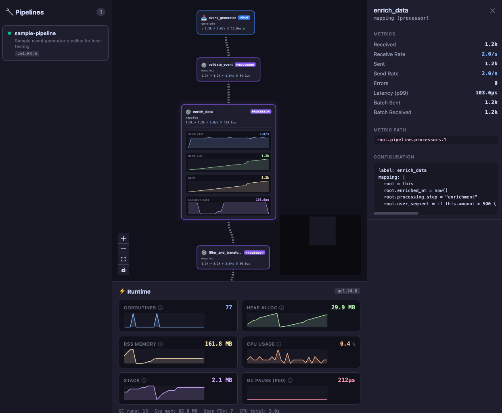

# 🌸 Flower

> "Flow"er, I know, right?

A real-time pipeline visualization and debugging UI for [Redpanda Connect](https://docs.redpanda.com/redpanda-connect/about/) (formerly Benthos). Flower renders your pipeline as an interactive DAG, overlays live Prometheus metrics on each node, and lets you inspect per-component throughput, error rates, and latency — all from the browser.



---

## Features

- **Interactive pipeline DAG** — automatically laid out with [dagre](https://github.com/dagrejs/dagre) and rendered via [React Flow](https://reactflow.dev). Nodes represent inputs, processors, outputs, caches, and rate limits.
- **Live metrics overlay** — edges scale in width based on traffic volume; zero-traffic edges are highlighted. Per-node counters (received, sent, errors) and rates update in real time.
- **Detail panel** — click any node to see its full metrics (throughput rates, latency percentiles, error counts) and its YAML configuration.
- **Runtime metrics panel** — Go runtime stats (goroutines, memory, GC) displayed as sparkline charts at the bottom of the viewport.
- **Multi-target support** — monitor several Redpanda Connect instances at once. Targets are defined in a simple JSON file and selectable from a sidebar.
- **Reverse-proxy built in** — the production Docker image uses Caddy to serve the SPA and proxy API calls to each Connect instance, avoiding CORS issues.

## Requirements

Flower talks to Redpanda Connect's HTTP API. Make sure each target instance is configured with:

```yaml
http:
  enabled: true
  debug_endpoints: true         # exposes /config and /metrics
  cors:
    enabled: true
    allowed_origins: ['*']      # only needed for local dev without the proxy

metrics:
  prometheus:
    add_process_metrics: true
    add_go_metrics: true        # required for the runtime metrics panel
```

## Quick Start — Docker Compose

The fastest way to try Flower with a sample pipeline:

```bash
# From the repo root
docker compose -f docker/docker-compose.yml up --build
```

This starts:

1. A **Redpanda Connect** container running the sample event-generator pipeline (`sample-connect.yaml`).
2. The **Flower** UI on [http://localhost:8080](http://localhost:8080), pre-configured to proxy to the Connect instance.

Open the browser, select **sample-pipeline** from the sidebar, and watch the DAG light up.

## Quick Start — Local Development

### 1. Start a Redpanda Connect instance

```bash
# Using Docker
docker run --rm -p 4195:4195 \
  -v $(pwd)/sample-connect.yaml:/connect.yaml \
  docker.redpanda.com/redpandadata/connect:4.74.0 -c /connect.yaml

# Or using rpk
rpk connect run -c sample-connect.yaml
```

### 2. Start the dev server

```bash
npm install
npm run dev
```

Vite starts on [http://localhost:3000](http://localhost:3000). The dev server is pre-configured to proxy `/api/proxy/sample-pipeline/*` to `localhost:4195`, so the sample pipeline works out of the box.

## Configuration

Flower discovers its targets from a `targets.json` file. Each entry has a name, upstream URL, and an optional description:

```json
[
  {
    "name": "my-pipeline",
    "url": "http://connect-host:4195",
    "description": "Production event processor"
  }
]
```

| Field         | Required | Description                                           |
|---------------|----------|-------------------------------------------------------|
| `name`        | yes      | Unique identifier; also used as the proxy path segment (`/api/proxy/<name>/…`) |
| `url`         | yes      | Base URL of the Redpanda Connect HTTP server           |
| `description` | no       | Human-readable label shown in the sidebar              |

### Where targets.json is loaded from

| Context             | Location                                                                 |
|---------------------|--------------------------------------------------------------------------|
| Local dev (Vite)    | `public/targets.json` — served by Vite's static file server             |
| Docker image        | Mount a file to `/config/targets.json` (override with `CONFIG_PATH` env var) |

## Docker

### Build the image

```bash
docker build -f docker/Dockerfile -t flower .
```

### Run with a custom targets file

```bash
docker run --rm -p 8080:8080 \
  -v $(pwd)/my-targets.json:/config/targets.json:ro \
  flower
```

The entrypoint script reads `targets.json` at startup, generates Caddy reverse-proxy routes for each target, and starts Caddy to serve both the SPA and the API proxies.

## Project Structure

```
flower/
├── docker/
│   ├── Caddyfile.template   # Caddy config template with proxy placeholder
│   ├── docker-compose.yml   # One-command local demo
│   ├── Dockerfile            # Multi-stage build (Node → Caddy)
│   ├── entrypoint.sh         # Generates Caddyfile from targets.json at startup
│   └── targets.docker.json   # Targets file used by docker-compose
├── public/
│   └── targets.json          # Default targets for local dev
├── src/
│   ├── App.tsx               # Root component — layout, target/node selection
│   ├── components/
│   │   ├── MetricsPanel.tsx      # Side panel with per-node metrics & config
│   │   ├── PipelineGraph.tsx     # React Flow DAG with traffic-scaled edges
│   │   ├── PipelineNode.tsx      # Custom node renderer (badges, sparklines)
│   │   ├── RuntimeMetricsPanel.tsx # Go runtime sparklines (goroutines, mem, GC)
│   │   ├── Sparkline.tsx         # Tiny inline SVG chart
│   │   └── TargetList.tsx        # Sidebar target selector
│   ├── hooks/
│   │   ├── useBenthosConfig.ts   # Fetches & parses /config into a DAG
│   │   ├── useBenthosMetrics.ts  # Polls /metrics (Prometheus) for counters
│   │   ├── useRuntimeMetrics.ts  # Polls Go process/runtime metrics
│   │   └── useTargets.ts         # Loads targets.json
│   ├── types/                # TypeScript interfaces
│   └── utils/                # Graph layout, metrics parsing, API helpers
├── sample-connect.yaml       # Example Redpanda Connect config for testing
├── package.json
├── vite.config.ts
└── tsconfig.json
```

## Tech Stack

| Layer          | Technology                              |
|----------------|-----------------------------------------|
| UI framework   | React 19                                |
| Graph rendering| React Flow (`@xyflow/react`)            |
| Graph layout   | dagre (`@dagrejs/dagre`)                |
| Data fetching  | TanStack React Query                    |
| YAML parsing   | js-yaml                                 |
| Build tool     | Vite 6                                  |
| Language       | TypeScript 5.8                          |
| Prod server    | Caddy 2 (static files + reverse proxy)  |

## License

See repository for license details.
